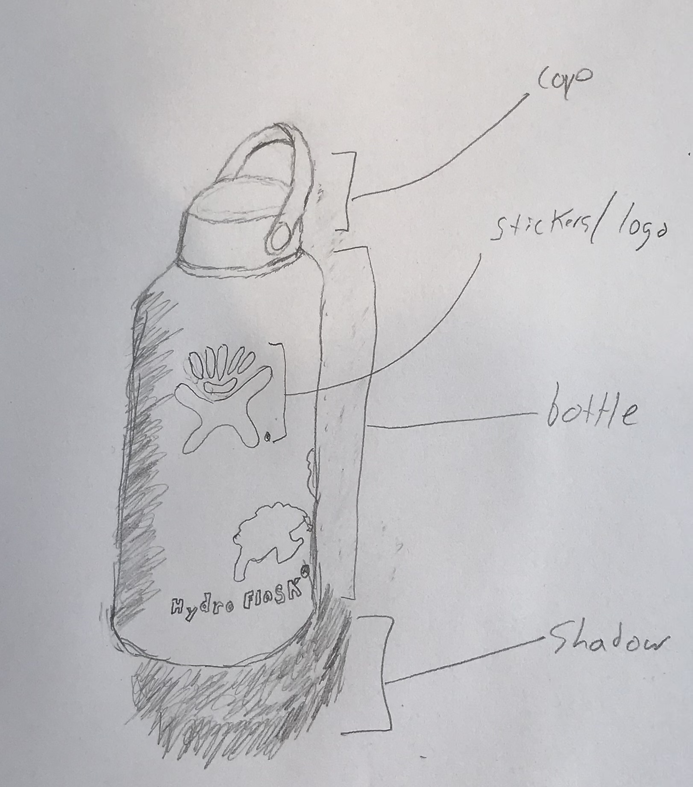

# Project plan

## The idea

I want to draw a 3d representation of my water bottle. Since it goes everywhere with me, I know it quite well - I notice new dings and scratches, when a new scuffs appears, when the handle squeaks differently than normal. If time allows, I'd also like to make an animated rotating version so that I can show off each of the stickers on my bottle. Ultimately, I'd like to make this into a sticker itself so that I can put a sticker of my water bottle on my water bottle

## Decomposition

I will divide this project up into 3 main pieces:

- `draw_bottle()`
- `draw_stickers()`
- `add_shading()`

Each of these pieces will be further broken down below. I will also create a `bottle_dimensions` dictionary which stores various dimensions for the bottle's drawing which will be needed throughout the program.

### draw_shadow( )

The first element of the drawing will be the shadow cast by the bottle. This will be drawn first so  that the bottle will be drawn on top of the shadow. The shadow will be a 2d representation of the bottle as a rounded rectangle.

### draw_bottle( )

This will be the largest portion of the drawing. I will divide the bottle into the metal base and the plastic cap.

#### draw_base()

I will divide the base into a regular cylinder and then a tapered cylinder for the top lip. I will attempt to employ Chris's 3D rendering function from the drawing package, but may end up writing my own if it doesn't work as expected. This will become an add perspective package/module (depending on how large it gets). The bottle will always be drawn centered in the display.

#### draw_cap( )

The cap will also be a relatively simple function which will draw the cylinder of the cap and then the handle of the cap. These two functions will be called after drawing the bottle so the cap appears in front of the back of the bottle cylinder. This drawing will rely on the positioning and size of the bottle which will be found in a settings dictionary passed from main.

### draw_stickers( )

This function will loop through a dictionary of sticker specifications and add them to the bottle. Each sticker will be defined as a list containing the following dictionary:
- `location`: a tuple (x,y) coordinate on the surface of the bottle where the first point will be drawn
- `points`: an ordered list of (x,y) tuples which define each point to be drawn on the bottle where the origin of the sticker plane maps to the `location` point in the overall bottle plane
- `color`: the fill color of the sticker

Using these specifications, the function will call a `draw_sticker()` function which draws a shape based on the specifications.

### bottle_dimensions

This dictionary will include the following:

- `bottle_radius`: the radius of the main cylinder of the bottle_sketch
- `bottle_height`: the height of the bottle
- `lip_radius`: the radius of the silver lip where the metal base of the bottle meets the cap
- `taper_height`: the height of the taper at the top metal portion of the bottle
- `cap_radius`: the radius of the cap
- `cap_height`: the height of the cap
- `handle_angle`: the angle the handle makes with the cap
- `bottle_rotation`: the rotation of the bottle based on its rotation around a vertical axis where 0º is defined as the handle attachment point pointing toward the viewer.
- `depth`: a number between 0 and 1 representing the perspective at which the viewer should see the bottle
- `color`: the color of the bottle

## Milestones

- **Milestone 0**: My first milestone will be to complete the `draw_base()` and `draw_cap()` functions.

## Timeline
**DEADLINE: Wednesday, Sept. 18**

I estimate my first milestone will take me about 4 hours to complete + 1 hour for cleaning up my code and getting my documentation in order.

**5 hours in total**
- I started working on my project on Wednesday, Sept. 11. for ~1 hour.
- I have a good chunk of time to work on the afternoon of Sunday, Sept. 15, ~4 hours
- I will finish up any additional work on my first milestone on Monday, Sept. 16 to prepare to show my work in class on Wednesday.
